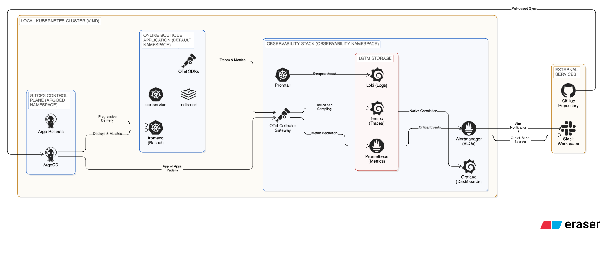

# 🚀 Enterprise SRE Platform & GitOps Bootcamp

An enterprise-grade Platform Engineering and Site Reliability Engineering (SRE) laboratory. This repository demonstrates the automated provisioning of a microservices architecture using the **GitOps** methodology, paired with a state-of-the-art **Observability** stack and **Progressive Delivery** mechanisms.

## 🏗️ Architecture Overview

This platform uses **ArgoCD** as the GitOps controller to manage a local Kubernetes cluster (KinD). It deploys Google's 11-tier "Online Boutique" microservices demo and injects a complete observability pipeline.

### Core Components
* **GitOps Controller:** ArgoCD (implementing the *App of Apps* pattern).
* **Progressive Delivery:** Argo Rollouts (automated Canary Deployments).
* **Data Plane / Telemetry:** OpenTelemetry (OTel) Collector.
* **Observability Stack (LGTM):**
    * **L**oki (Log aggregation with label indexing).
    * **G**rafana (Dashboards as Code).
    * **T**empo (Distributed Tracing).
    * **P**rometheus & Alertmanager (Symptom-based alerting).



### 🔄 System Flow
1. **Control Plane (GitOps):** ArgoCD monitors this repository and reconciles the cluster state. The `root-app` automatically bootstraps the entire environment, deploying both the microservices and the observability stack.
2. **Data Plane (Telemetry):** The Online Boutique microservices generate telemetry. OpenTelemetry SDKs push Traces and Metrics to the OTel Collector Gateway, while Promtail scrapes stdout container Logs.
3. **Processing & Storage:** The OTel Collector intercepts the data in flight, applies processing rules (redacting high-cardinality labels, tail-based sampling), and routes it to the LGTM backends.
4. **Action & Visualization:** Grafana provides a single-pane-of-glass for native log/trace correlation. Simultaneously, Alertmanager evaluates Prometheus metrics against defined SLOs to trigger intelligent Slack notifications.

## 🧠 Key SRE Concepts Implemented

This project goes beyond simple tool installation, focusing on real-world SRE practices:

* **Symptom-Based Alerting (SLOs):** Configured `PrometheusRules` to alert on high error rates and latency (User-impacting symptoms) rather than just CPU/Memory spikes, reducing alert fatigue.
* **Alert Routing & Inhibition:** Alertmanager configuration to group alerts and inhibit redundant notifications (e.g., silencing `PodCrash` alerts if a `NodeDown` alert is actively firing).
* **Secure Secret Management:** Slack Webhook integration for Alertmanager using **Out-of-Band Secret Injection**, ensuring zero hardcoded credentials in Git.
* **Telemetry Pipeline Optimization:**
    * Resolved High-Cardinality issues by redacting/dropping dynamic labels at the OTel Collector level before reaching Prometheus.
    * Implemented context propagation (`TraceID`) across polyglot microservices.
    * Correlated Logs and Traces natively in Grafana using Loki's derived fields.
* **Progressive Delivery:** Transformed standard Kubernetes `Deployments` into Argo `Rollouts` via Kustomize patches to enable automated, metric-driven Canary releases.

## 📂 Repository Structure (App of Apps Pattern)

```text
.
├── README.md
├── root-app.yaml                 # The master ArgoCD Application that deploys all argocd-apps
├── apps/
│   └── boutique/                 # Kustomize patches for the microservices
│       ├── kustomization.yaml    # Injects OTel env vars, Service scraping, and Rollout mutations
│       └── otel-alias.yaml       # Service alias for OTel Collector routing
└── infrastructure/
    ├── argocd-apps/              # Child applications managed by root-app (App of Apps pattern)
    │   ├── argo-rollouts-app.yaml
    │   ├── boutique-app.yaml
    │   ├── grafana-app.yaml      # Provisions Dashboards as Code
    │   ├── loki-app.yaml
    │   ├── observability-app.yaml
    │   ├── prometheus-app.yaml   # Includes Alertmanager rules and Slack integration
    │   ├── promtail-app.yaml     # Log scraping DaemonSet
    │   ├── reloader-app.yaml     # Automatic pod restarts on configMap/Secret changes
    │   └── tempo-app.yaml        # Distributed Tracing backend
    └── observability/            # Custom manifests for the telemetry pipeline
        ├── otel-configmap.yaml   # OTel Collector Gateway configuration (Sampling, Redaction)
        └── otel-deployment.yaml  # OTel Gateway deployment and service
```

---

## 🛠️ Quick Start (Local Reproduction)

1. **Provision a local cluster:**

```Bash
kind create cluster --name sre-platform
```
2. **Install ArgoCD:**

```Bash
kubectl create namespace argocd
kubectl apply -n argocd -f [https://raw.githubusercontent.com/argoproj/argo-cd/stable/manifests/install.yaml](https://raw.githubusercontent.com/argoproj/argo-cd/stable/manifests/install.yaml)
```
3. **Bootstrap the Platform (App of Apps):**

```Bash
kubectl apply -f infrastructure/root-app.yaml
```
4. **Access the Dashboards:**

Use `kubectl port-forward` to access ArgoCD, Grafana, or the Argo Rollouts dashboard.

---

## 👤 Author

**Justino Boggio**

*DevSecOps Engineer | Cloud Engineer | SRE | Information Systems Engineer*

[LinkedIn](https://www.linkedin.com/in/justino-boggio-75a932204) | [GitHub](https://github.com/JustinoBoggio)